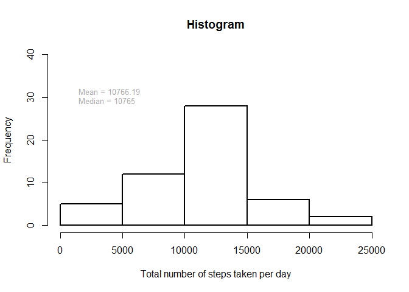
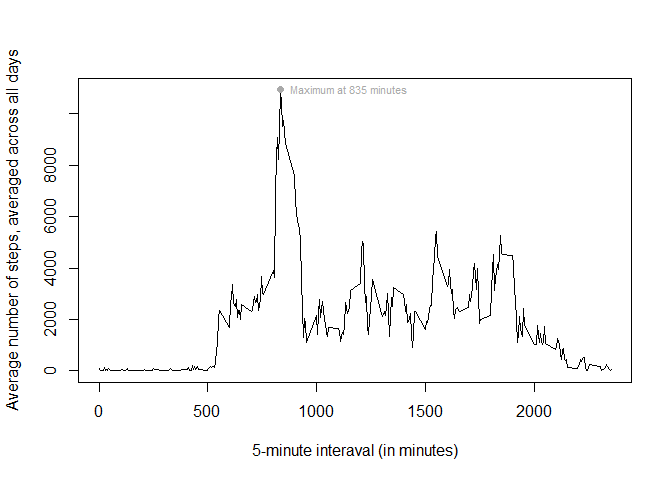
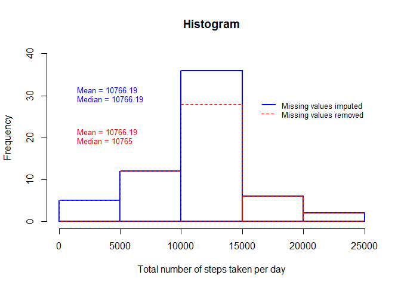
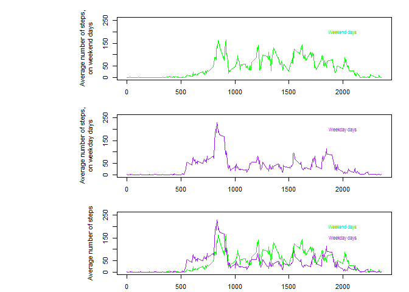

# Reproducible Research: Peer Assessment 1
moocic  

<br>

## Loading and preprocessing the data

The variables included in this dataset are: `steps` number of steps taking in a 5-minute
interval (missing values are coded as NA); `date` the date on which the measurement was taken
in YYYY-MM-DD format; `interval` identifier for the 5-minute interval in which measurement
was taken.


```r
temp <- tempfile()
download.file("https://github.com/moocic/RepData_PeerAssessment1/raw/master/activity.zip", temp)
dataset <- read.csv(unz(temp, "activity.csv"))
unlink(temp)
dataset$date <- as.Date(dataset$date)
head(dataset); str(dataset)
```

```
##   steps       date interval
## 1    NA 2012-10-01        0
## 2    NA 2012-10-01        5
## 3    NA 2012-10-01       10
## 4    NA 2012-10-01       15
## 5    NA 2012-10-01       20
## 6    NA 2012-10-01       25
```

```
## 'data.frame':	17568 obs. of  3 variables:
##  $ steps   : int  NA NA NA NA NA NA NA NA NA NA ...
##  $ date    : Date, format: "2012-10-01" "2012-10-01" ...
##  $ interval: int  0 5 10 15 20 25 30 35 40 45 ...
```

<br>

## What is mean total number of steps taken per day?


```r
comp <- complete.cases(dataset)
totalstepsday <- aggregate(dataset[comp, 1],
                           by = list(dataset$date[comp]),
                           FUN = sum,
                           na.rm = TRUE)
totalstepsday_mean_narm <- paste(round(mean(totalstepsday$x), 2))
totalstepsday_median_narm <- median(totalstepsday$x)
totalstepsday_min_narm <- min(totalstepsday$x)
totalstepsday_max_narm <- max(totalstepsday$x)
par(lwd = 2)
hist(totalstepsday$x,
     xlab = "Total number of steps taken per day",
     main = "Histogram",
     ylim = c(0,40))
text(1000, 30,
     paste("Mean =", totalstepsday_mean_narm,
           "\nMedian =", totalstepsday_median_narm),
     pos = 4,
     col = "darkgrey",
     cex = 0.8)
```

<!-- -->

The total steps taken per day vary from 41 to 21194, with a
mean of 10766.19 and a median of 10765.

<br>

## What is the average daily activity pattern?


```r
pattern <- aggregate(dataset[comp, 1],
                     by = list(dataset$interval[comp]),
                     FUN = sum,
                     na.rm = TRUE)
maximum <- which.max(pattern$x)
ymax <- pattern$x[maximum]
xmax <- pattern$Group.1[maximum]
par(lwd = 1.5)
plot(pattern$Group.1,
     pattern$x,
     type = "l",
     xlab = "5-minute interaval (in minutes)",
     ylab = "Average number of steps, averaged across all days")
points(xmax, ymax,
       pch = 16,
       col = "darkgrey")
text(xmax, ymax,
     paste("Maximum at", xmax, "minutes"),
     pos = 4,
     cex = 0.7,
     col = "darkgrey")
```

<!-- -->

The 5-minute interval which, on average across all the days in the dataset, contains the
maximum number of steps, was the 104th 5-minute interval, at 835 minutes, with an
average of 10927 steps.

<br>

## Imputing missing values


```r
steps_missings <- sum(is.na(dataset$steps))
row_missings <- sum(!complete.cases(dataset))
percentage <- round(row_missings/nrow(dataset)*100,2)
data.frame(steps_missings, row_missings, percentage)
```

```
##   steps_missings row_missings percentage
## 1           2304         2304      13.11
```

From the observations in the data set, 2304 (13.11 %) had
missing values (all in the `steps` variable).


```r
dailymean <- aggregate(dataset[comp, 1],
                       by = list(dataset$date[comp]),
                       FUN = mean,
                       na.rm = TRUE)
colnames(dailymean) <- c("date", "dailymean")
minutesmean <- aggregate(dataset[comp, 1],
                         by = list(dataset$interval[comp]),
                         FUN = mean,
                         na.rm = TRUE)
colnames(minutesmean) <- c("interval", "minutesmean")
dataset_nona <- merge(dataset, dailymean, by = "date",
                      all = TRUE)
dataset_nona <- merge(dataset_nona, minutesmean, by = "interval",
                      all = TRUE)
dataset_nona <- dataset_nona[order(dataset_nona[, 2], dataset_nona[, 1]), ]
dataset_nona$stepsbefore <- c(dataset_nona$steps[-nrow(dataset_nona)], NA)
dataset_nona$stepsafter <- c(NA, dataset_nona$steps[-1])
naindex <- is.na(dataset_nona$steps)
dataset_nona[naindex, 3] <- rowMeans(dataset_nona[naindex, 4:7],
                                     na.rm = TRUE)
head(dataset_nona); str(dataset_nona)
```

```
##     interval       date     steps dailymean minutesmean stepsbefore
## 1          0 2012-10-01 1.7169811        NA   1.7169811          NA
## 115        5 2012-10-01 0.3396226        NA   0.3396226          NA
## 133       10 2012-10-01 0.1320755        NA   0.1320755          NA
## 221       15 2012-10-01 0.1509434        NA   0.1509434          NA
## 274       20 2012-10-01 0.0754717        NA   0.0754717          NA
## 314       25 2012-10-01 2.0943396        NA   2.0943396          NA
##     stepsafter
## 1           NA
## 115         NA
## 133         NA
## 221         NA
## 274         NA
## 314         NA
```

```
## 'data.frame':	17568 obs. of  7 variables:
##  $ interval   : int  0 5 10 15 20 25 30 35 40 45 ...
##  $ date       : Date, format: "2012-10-01" "2012-10-01" ...
##  $ steps      : num  1.717 0.3396 0.1321 0.1509 0.0755 ...
##  $ dailymean  : num  NA NA NA NA NA NA NA NA NA NA ...
##  $ minutesmean: num  1.717 0.3396 0.1321 0.1509 0.0755 ...
##  $ stepsbefore: int  NA NA NA NA NA NA NA NA NA NA ...
##  $ stepsafter : int  NA NA NA NA NA NA NA NA NA NA ...
```

The missing values in the `steps` variable were replaced by the mean of: average steps per day,
average steps per 5-minute interval, steps taken in previous the 5-minute interval and steps taken
in the later 5-minute interval (if data avaiable).


```r
totalstepsday_nona <- aggregate(dataset_nona[, 3],
                                by = list(dataset_nona$date),
                                FUN = sum,
                                na.rm = TRUE)
totalstepsday_mean_nona <- paste(round(mean(totalstepsday_nona$x), 2))
totalstepsday_median_nona <- paste(round(median(totalstepsday_nona$x), 2))
totalstepsday_min_nona <- min(totalstepsday_nona$x)
totalstepsday_max_nona <- max(totalstepsday_nona$x)
par(lwd = 2)
hist(totalstepsday_nona$x,
     xlab = "Total number of steps taken per day",
     main = "Histogram",
     ylim = c(0,40),
     border = "blue")
par(lwd = 1)
hist(totalstepsday$x,
     xlab = "Total number of steps taken per day",
     main = "Histogram",
     ylim = c(0,40),
     border = "red",
     lty = 2,
     add = TRUE)
text(1000, 30,
     paste("Mean =", totalstepsday_mean_nona,
           "\nMedian =", totalstepsday_median_nona),
     pos = 4,
     col = "blue",
     cex = 0.8)
text(1000, 20,
     paste("Mean =", totalstepsday_mean_narm,
           "\nMedian =", totalstepsday_median_narm),
     pos = 4,
     col = "red",
     cex = 0.8)
legend(16000, 30,
       c("Missing values imputed", "Missing values removed"),
       col = c("blue", "red"),
       lty = c(1, 2),
       lwd = c(2, 1),
       bty = "n",
       cex = 0.8)
```

<!-- -->

Although the mean and the median of total number of steps taken per day did not change greatly,
the number of observations around the mean and median increased by imputing missing data on the
estimates of the total daily number of steps.

<br>

## Are there differences in activity patterns between weekdays and weekends?


```r
dataset_nona$week <- as.numeric(format(dataset_nona$date, "%w"))
dataset_nona$weekdayend <- as.factor(ifelse(dataset_nona$week==0 | dataset_nona$week==6,
                                            "weekend",
                                            ifelse(0 < dataset_nona$week & dataset_nona$week < 6,
                                                   "weekday",
                                                   NA)))
pattern_weekend <- aggregate(dataset_nona[dataset_nona$weekdayend=="weekend", 3],
                             by = list(dataset_nona$interval[dataset_nona$weekdayend=="weekend"]),
                             FUN = mean,
                             na.rm = TRUE)
pattern_weekday <- aggregate(dataset_nona[dataset_nona$weekdayend=="weekday", 3],
                             by = list(dataset_nona$interval[dataset_nona$weekdayend=="weekday"]),
                             FUN = mean,
                             na.rm = TRUE)
maximum_week <- max(c(pattern_weekend$x, pattern_weekday$x))
par(mfrow=c(3,1),
    mai=c(0.3,2,0.3,0.3))
plot(pattern_weekend$Group.1,
     pattern_weekend$x,
     type = "l",
     xlab = "5-minute interaval (in minutes)",
     ylab = "Average number of steps,\non weekend days",
     ylim = c(0, maximum_week*1.1),
     col = "green")
text(2000, 200,
     "Weekend days",
     col = "green",
     cex = 0.8)
plot(pattern_weekday$Group.1,
     pattern_weekday$x,
     type = "l",
     xlab = "5-minute interaval (in minutes)",
     ylab = "Average number of steps,\non weekday days",
     ylim = c(0, maximum_week*1.1),
     col = "purple")
text(2000, 200,
     "Weekday days",
     col = "purple",
     cex = 0.8)
plot(pattern_weekend$Group.1,
     pattern_weekend$x,
     type = "l",
     xlab = "5-minute interaval (in minutes)",
     ylab = "Average number of steps",
     ylim = c(0, maximum_week*1.1),
     col = "green")
lines(pattern_weekday$Group.1,
      pattern_weekday$x,
      col = "purple")
text(2000, 200,
     "Weekend days",
     col = "green",
     cex = 0.8)
text(2000, 150,
     "Weekday days",
     col = "purple",
     cex = 0.8)
```

<!-- -->
<br>
<br>
Globally the patterns are similar. However, on average there tend to be more steps taken in mornings on weekdays than on weekends, and more steps taken in the afternoon on weekends than
on weekdays.
